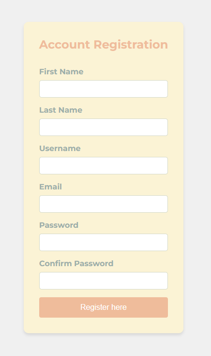

# Account Registration

In this exercise you will build a form in which you can simulate a creation of an account to some web application. The purpose of this exercise is to practise on using different event listeners _( several are needed )_ but also to create a basic application that is comprised of HTML, CSS and JavaScript.

The form should have to following content and functionlity.

1. The form has five inputs (`first name`, `last name`, `username`, `email`, `password`, `confirm password`) within a <form> element.

2. There's a submit button for the form.

3. Labels are connected to inputs **without** using the `for `attribute. Clicking on a label will focus the corresponding input.

4. All inputs are required.

5. The `password` must be at least 8 characters long and there is appropriate styling for invalid input.

6. The `confirm password` is validated to be identical to the `password`, with appropriate styling for mismatches.

7. The submit button is disabled when the password or confirm password is invalid.

8. On form submission, the data is presented in an object and logged to the console and shown in an alert.

```js
const registrationData = {
  first name: 'first name',
  last name: 'last name',
  username: 'username',
  email: 'email@email.com',
  password: 'password',
};
```

- For the HTML I used semantic elements and classes instead of IDs.
- I used flexbox for responsiveness and the layout adjusts for smaller screens.
- The JavaScript is clean and well-organized, handling all the required functionality.

---

### Screenshot of my form:



### Colour palette I used:


